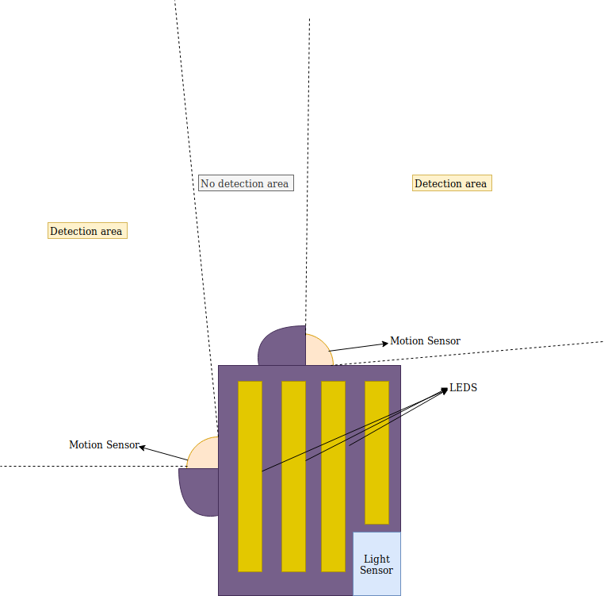
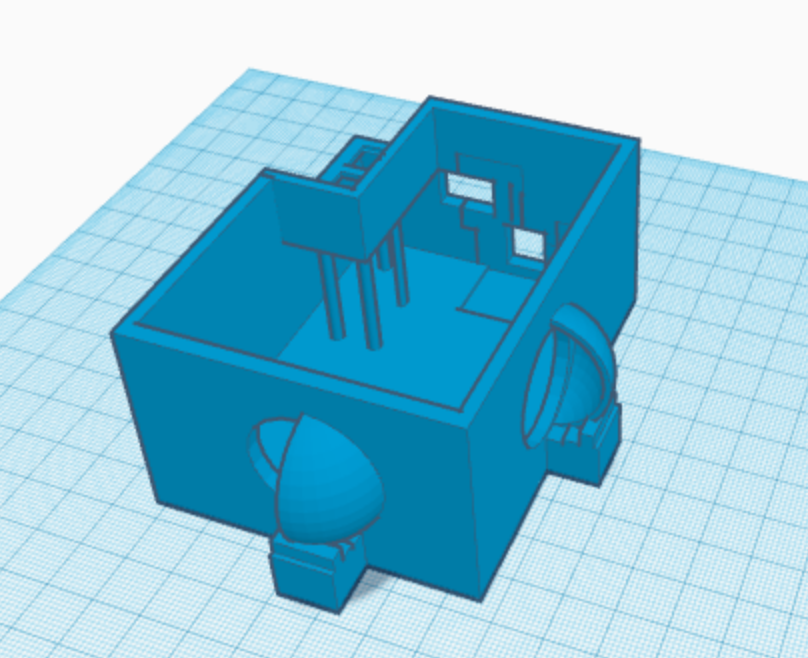
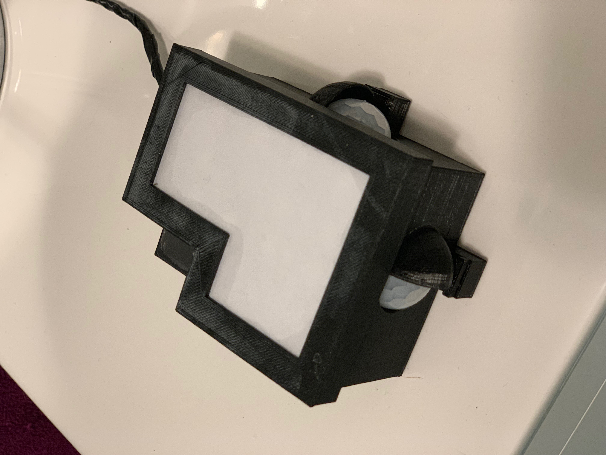
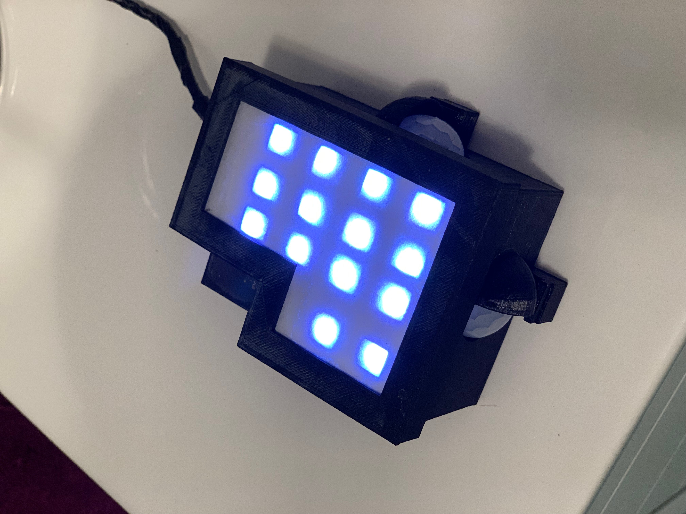

# Introduction and background
This project is about a LED lamp that switches ON and OFF depending on light and motion conditions.
We have all experienced the situation when, at night, nature calls, and we need to make a quick trip to the bathroom. Doing this trip in the darkness can be quite an adventure for some people and in some rooms, but switching the main light of the room might not be the best solution in some cases: annoys the partner, is far away, to bright for your sleepy eyes...
The solution to this problem is easy! A faint light that switches on when you go to the bathroom and switches off once you are already back in bed.
Trying to find such a device on the market, I find many motion-enabled lights. A little bit problematic is that most of them are designed for outdoors lighting, so the light is quite powerful. But the biggest problem is that all these lights are controlled by an unique motion sensor: any motion detected will trigger the light. This could be you waking up and going to the bathroom, or you just moving in the bed.
I could not find any device in the market that focuses on preventing false positives, and this is the most important feature I would ask to a device that might wake me up randomly at night.

# Proposed solution
The ideal solution to this problem would be a device that only goes off when you are already up and walking towards your destination, but does not go off when you or any other thing in your room moves a little bit (e.g: curtains, clothes falling from the chair…).
I want to define a virtual line that  when is crossed, triggers the light. I also want this only happens if we really need some extra light and I want the light to be on as long as I need it to be on and to switch off automatically when I no longer need it.

The first thing that you could think of when I talk about “crossing a virtual line” may be a ultrasonic distance sensor (e.g: HC-SR04). These sensors are based on sound reflection, and they do not work very good with clothes. Besides, having a single sensor keeps high the probabilities of false positives.
This solution consists of two PIR motion sensors placed in such a way that their areas of detection do not overlap. The area of “no detection” will be the virtual line to cross. When both sensors detect a motion and the time difference between the detection is short enough, we can assume that the virtual line has been crossed. If the time difference between detections is larger than a threshold, we can assume that the detection events are sporadic and not related to each other, so no action will be taken. This will exclude most of the false positives that would have triggered a device with a single motion sensor.

To ensure that the lamp only switches on when there is not enough light to see, the system will integrate a light sensor and define a light threshold above which the system will ignore motion events.
Depending on the configured lighting level of the LEDs, when the lamp is on it might trick the light sensor to think that there is enough ambient light to ignore motion events and go to “day” mode. This would trigger an oscillation going on with motion and off because of the light amount. To avoid this irritating behavior, the system is configured to consider the light amount only when the light is off.

To ensure the third requirement of being on until the light is no longer needed, once the system is on, a timer will start. Whenever a new motion event is detected, the timer will be restarted. When a timeout event happens, the light will switch off.

# The mechanics
This repository contains a 3D model of a box (base, top and cover) that is specifically designed to prevent overlapping of the two motion sensors.
It also leaves an open slot to allow the light sensor to “see”. I would recommend to cover it with a transparent material. The light threshold will need to be adapted to the light conditions of the room and the cover material chosen.

I decided to embed the light in the box, to make a single-piece device, so I also left open slots for the LEDs. It is of course possible to modify the 3D design to place the LEDs in a different way, separate the lighting device from the “control” box…
It should also be doable to use a different lighting device, like a normal map controlled by a relay or an IR-controlled bulb.
I currently only support LED stripe as lighting device, any other method is not yet supported and would need to be implemented.
I might add support for other lighting devices in future updates of the project.

# The hardware
The device consists of the following hardware components:
* Arduino Nano.
* HC-SR501 PIR motion sensor (x2).
* BH1750 light sensor.
* WS2812B led stripe and 5v power supply. More information about how to handle and power this led stripe: https://www.pololu.com/product/2547
* 330 Ohm resistor.

# Software & Configuration
To configure the software and flash it into your Arduino, follow the next steps:
1. Clone this repository. Remember to do it recursively to get also the FastLED library.
2. Open the configuration file “config.h” and change the following parameters for your use case:
* NUM_LEDS: number of leds in your LED stripe. By default X LEDs fit in the given 3D model.
* LIGHT_THRESHOLD: above this value, the device is in “Day” mode and will ignore motion events. It is recommended to measure the light level in your room with the debug traces to find the right value.
* DETECTION_INTERVAL: maximum time difference between motion detection of each of the sensors to assume that the virtual line was crossed.
* DEBUG_ENABLED:
  * ON :enables the traces printed in the Serial console.
  * OFF: disables them.
* LIGHT_VALUE_[R,G,B]: defines the (R,G,B) levels of the light.
* STARTUP_EFFECT:
  * ON: enables a colorful effect when the system is powered ON.
  * OFF: disables the effect.
* LIGHT_EFFECT:
  * 0: no effect.
  * 1: led array effect. (DELAY_ARRAY has to be configured as well then)
  * 2: fade effect. (DELAY_FADE has to be configured as well then)
* KEEP_ON_CONDITION:
  * SINGLE_MOTION: once the light is ON, a motion event detected by either of the sensors will restart the timer.
  * DOUBLE_MOTION: once the light is ON, the timer will be restarted only if the ON condition is triggered again (both sensors detect motion within a defined time).
3. Flash the software into the Arduino.

#Final result
It is not the prettiest home automation gadget, but it does its job.

Here a video of the lamp doing its thing:
https://youtu.be/2kOvvQYK9II
